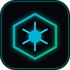

# 🛸 NEO-OPS // 极客私有云/NAS 智能监控面板与 AI 运维协同终端

<p align="center">
  
</p>

<p align="center">
  <b>专为 NAS 极客、家庭运维人员及多媒体集群打造的现代化深色监控大屏与智能运维助手</b><br>
  秒级全盘遥测 · 硬盘 S.M.A.R.T 热力矩阵 · qBittorrent 下载中枢接管 · Docker 容器治理 · Gemini AI 双模终端 · 5 套全景主题
</p>

<p align="center">
  
  
  
  
  
  
</p>

---

## 🌟 核心特性 (Key Features)

### 1. 📊 高密度硬件与网络时序遥测
- **2.5GbE 全双工吞吐监控**：实时上下行速率、双通道动态微波形（Micro Sparkline）与累计流量统计。
- **CPU 负荷 & 多核热力矩阵**：对称 KPI 设计，精准映射 CPU Package 温度、4 核心独立温控热力与机箱风扇转速。
- **物理内存复合图谱**：应用实体占用、Page Cache（系统缓存）与 Swap 交换分区无损透视，杜绝溢出。
- **系统平均负载（Load Average）多维对比**：1m / 5m / 15m 负载对比条形图，动态判定超载与 I/O 阻塞。

### 2. 💾 硬盘阵列与 S.M.A.R.T 温度热力监控
- **多盘位 SATA / NVMe 拓扑**：清晰展示盘位型号、容量与运行健康度。
- **语义温度预警体系**：严格标定 `< 40°C 优良` · `40~48°C 正常` · `≥ 49°C 警报`，异常自动触发脉冲警报。
- **存储卷与云盘池利用率**：动态扫描 CACHEDEV 数据卷、系统卷与挂载网盘容量分布。

### 3. 🚀 NAS 服务与下载中枢深度接管
- **qBittorrent 6 维极客监控**：下载速率、上传速率、活跃/总任务、下载/做种分布、累计传输量、DHT 节点数。
- **传输控制安全联锁**：支持「一键暂停全部」、「一键恢复全部」与「切换备用慢速限速模式」。
- **生态微服务网关直达**：Jellyfin、Immich、Mihomo 等常用家庭微服务在线健康检测与一键跳转。

### 4. 🐳 Docker 容器全生命周期治理
- **容器矩阵卡片**：运行状态实时探针、镜像标签、多端口映射快速直达。
- **容器运维**：支持一键容器重启、实时运行日志（Tail 250 行）深度溯源与复制。
- **存储自愈治理**：一键安全清理所有未引用的 Docker 悬空镜像（Dangling Images），释放宝贵磁盘空间。

### 5. 🤖 极客智能运维终端（AI Copilot）
- **本地规则引擎 + Gemini 双模驱动**：支持自然语言直接下发指令（如“暂停下载”、“全盘健康体检”、“检查温控”、“重启容器”等）。
- **预设情景诊断卡片 & 实时审计日志流（Audit Log）**：点击即开诊，彻底告别冷启动空白。

### 6. 🎨 5 套全景极客视觉主题（即时切换）
- 🔮 **曜石赛博 (Obsidian Cyber)**：默认经典蓝黑霓虹质感，极客科技氛围。
- ⚡ **钛金工业 (Titanium Industrial)**：Linear / Vercel 哑光冷钛灰，去光污染，极致耐看。
- ❄️ **北欧极光 (Nordic Nord)**：极夜深灰蓝与极光青绿，低对比超护眼，夜间注视零疲劳。
- 🎯 **战术雷达 (Stealth Tactical)**：炭黑背景与夜视绿指示，硬核军规与机甲态势。
- 📻 **复古琥珀 (Amber CRT)**：80 年代 DEC / IBM 终端暖调琥珀荧光与纯粹字符美学。

---

## 🚀 快速上手 (Quick Start)

### 方式一：Docker Compose（推荐）

1. 克隆代码仓库：
   ```bash
   git clone https://github.com/your-username/neo-ops.git
   cd neo-ops
   ```

2. 准备配置文件（可选）：
   ```bash
   cp .env.example .env
   cp config.example.json config.json
   ```

3. 启动容器服务：
   ```bash
   docker compose up -d
   ```

4. 打开浏览器访问：**`http://<您的NAS或主机IP>:9832`**

---

### 方式二：Docker CLI 单行运行

```bash
docker run -d \
  --name neo-ops \
  --restart unless-stopped \
  --net host \
  -v /var/run/docker.sock:/var/run/docker.sock \
  -v /proc:/host/proc:ro \
  -v /sys:/host/sys:ro \
  -v /:/host/root:ro \
  -v /tmp/smart:/host/tmp/smart:ro \
  -v /share:/host/share:ro \
  -v $(pwd)/data:/data \
  -e TZ=Asia/Shanghai \
  -e QB_URL=http://127.0.0.1:8080 \
  -e QB_USER=admin \
  -e QB_PASS=your_password \
  neo-ops:latest
```

---

## ⚙️ 环境变量与配置项 (Configuration)

支持通过 `.env` 或 `config.json` 注入配置：

| 环境变量 | 默认值 | 作用描述 |
| :--- | :--- | :--- |
| `TZ` | `Asia/Shanghai` | 容器时区 |
| `QB_URL` | `http://127.0.0.1:8080` | qBittorrent WebUI 地址 |
| `QB_USER` | `admin` | qBittorrent 用户名 |
| `QB_PASS` | `""` | qBittorrent 登录密码 |
| `GEMINI_API_KEY`| `""` | Google Gemini API Key（支持在网页设置中动态修改） |
| `LLM_PROVIDER` | `gemini` | 大模型服务商（`gemini` / `openai` / `deepseek`） |
| `LLM_MODEL` | `gemini-3.8-flash` | 大模型型号（默认采用低延迟 Gemini 3.8 Flash） |
| `NAS_HOSTNAME` | 自动从宿主机获取 | 宿主机节点名称标识 |

---

## 📂 挂载卷说明 (Mount Paths)

为了实现宿主机的物理硬件与容器状态感知，建议保留以下挂载映射：

- `/var/run/docker.sock`：用于监控 Docker 容器状态、日志与清理悬空镜像。
- `/proc` -> `/host/proc:ro`：读取宿主机 CPU 占用、Load Average、2.5GbE 网卡流量与开机时间。
- `/sys` -> `/host/sys:ro`：读取 CPU 多核温度、风扇转速、主板传感器与硬盘型号。
- `/tmp/smart` -> `/host/tmp/smart:ro`：威联通 QTS / Linux S.M.A.R.T 温度信息共享。
- `/share` -> `/host/share:ro`：存储池容量分布（如 CACHEDEV、CloudDrive 挂载等）。
- `./data` -> `/data`：持久化保存本地配置（如 API Key 与用户偏好）。

---

## 🛠️ 技术栈 (Tech Stack)

- **后端 (Backend)**：Python 3.11, FastAPI, Uvicorn, Httpx (异步非阻塞遥测总线)
- **前端 (Frontend)**：Vue 3 (Composition API), Tailwind CSS (JIT), Lucide Icons, Marked.js
- **设计系统 (Design System)**：纯 CSS 变量多主题引擎, Tabular-nums 等宽数字防抖, Glassmorphism 毛玻璃质感

---

## 🔒 隐私与安全承诺 (Security & Privacy)

- **绝不上传敏感信息**：所有主机硬件遥测、存储路径与网络流量均仅在本地运行，不向任何第三方上报。
- **无外网凭据泄露风险**：所有密码与 API Key 支持完全通过环境变量或本地私有 `config.json` 隔离管理。

---

## 📄 开源许可证 (License)

本项目基于 [MIT License](LICENSE) 开源发布。
欢迎提交 Issue 或 Pull Request 共建极客运维体验！
